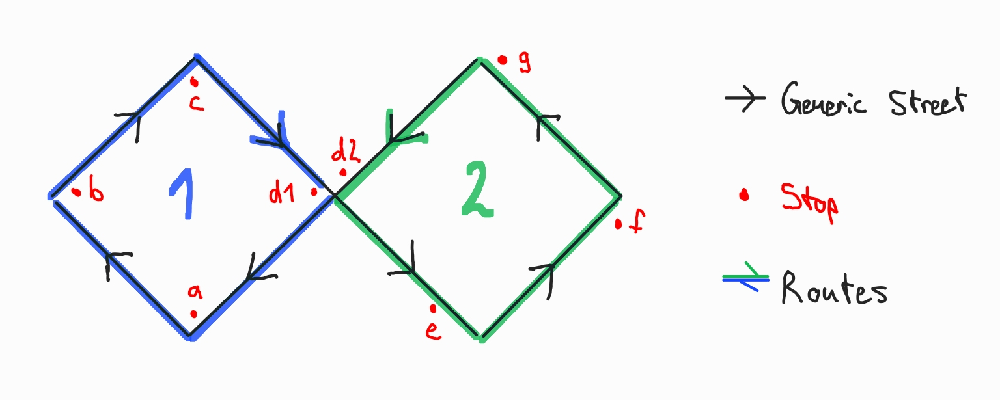

# simple-gtfs-example
A stupidly simple implementation of the General Transit Feed Specification.

This example feed only contains the required and conditionally required files of the GTFS static.

An in depth explanation of this example feed can be found here:
https://medium.com/@noah.lehmann/a-simple-introduction-to-gtfs-7d954d9ccb51

The following image show the order of stops and their relative positioning towards each other.

